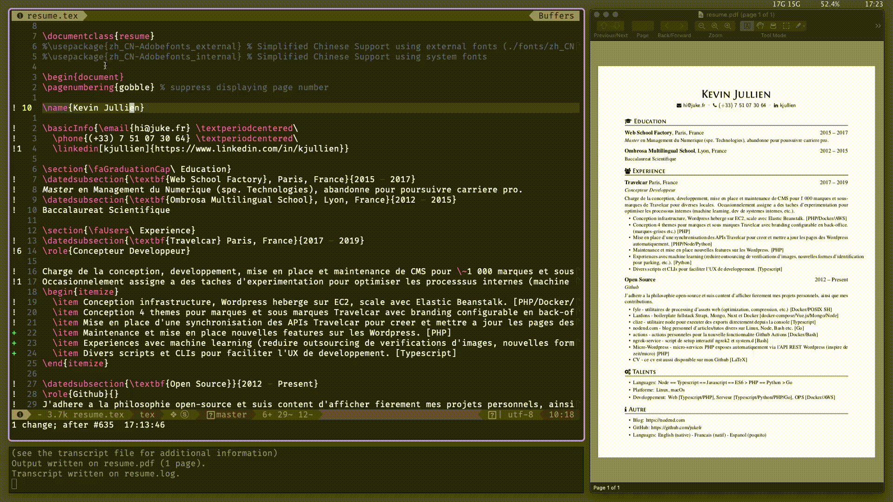

+++
title = "Ricing macOs in 2019"
date = 2019-01-11T03:11:01+02:00
description = "Apple has been notoriously concerned about user customization to macOs, however it is still possible to achieve a decent keyboard-only riced experience even today."
toc = true
categories = ["macos"]
tags = ["ricing"]
images = [
  "/post/ricing-macos/images/demo.png"
] # overrides the site-wide open graph image
[[resources]]
  src = "images/demo.bpg"
  name = "demo"
+++

<!--more-->

Currently being written come back later.



# Workflow Examples

## LaTeX

<video autoplay loop>
    <source src="images/latex.webm" type="video/webm" />
    <source src="images/latex.mp4" type="video/mp4" />
    
</video>


## Web Development w/ Browser Reload

<video autoplay loop>
    <source src="images/web.webm" type="video/webm" />
    <source src="images/web.mp4" type="video/mp4" />
    
</video>


